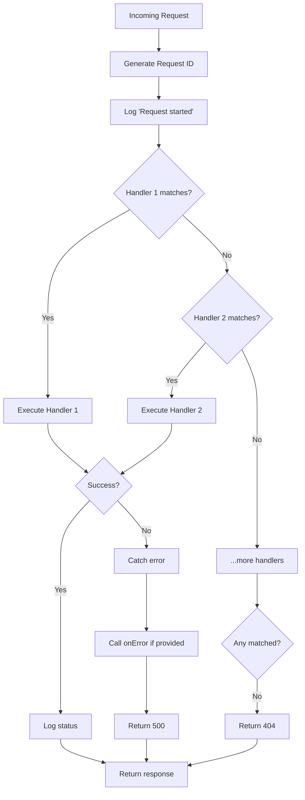

`createFetchHandler` takes an array of handlers and returns a Bun-compatible `fetch` function. It processes handlers in order, logs requests, and handles errors gracefully.

## Basic Usage

```typescript
import { createFetchHandler, basicHandler } from 'ff-serv'
import { Effect } from 'effect'

const program = Effect.gen(function* () {
  const fetch = yield* createFetchHandler([
    basicHandler('/health', () => new Response('OK')),
    basicHandler('/ping', () => new Response('pong')),
  ])

  Bun.serve({ port: 3000, fetch })
})

Effect.runPromise(program)
```

## How It Works

1. **Handler Chain**: Processes handlers in order until one matches
2. **Request Logging**: Automatically logs request start/end with status codes
3. **Error Handling**: Catches all errors and returns 500 responses
4. **Request ID**: Generates a unique 6-character ID for each request
5. **OpenTelemetry**: Creates a span named `http` for each request

## Handler Matching

Handlers are evaluated sequentially. The first handler that matches processes the request:

```typescript
const fetch = yield* createFetchHandler([
  basicHandler('/exact', () => new Response('Exact match')),
  basicHandler((url) => url.pathname.startsWith('/api/'), () => 
    new Response('API fallback')
  ),
  // This runs if no previous handler matched
  basicHandler(() => true, () => new Response('Catch-all')),
])
```

<Note>
  If no handlers match, a `404 Not Found` response is returned automatically.
</Note>

## Type Inference

The return type infers all service requirements from your handlers:

```typescript
import { HttpClient } from '@effect/platform'
import type { Scope } from 'effect'

const handler = basicHandler('/proxy', () =>
  Effect.gen(function* () {
    const client = yield* HttpClient.HttpClient
    // ...
  })
)

// Type: Effect.Effect<(request: Request) => Promise<Response>, never, HttpClient.HttpClient | Scope.Scope>
const program = createFetchHandler([handler])
```

Provide the required services before running:

```typescript
import { FetchHttpClient } from '@effect/platform'

Effect.runPromise(
  program.pipe(
    Effect.provide(FetchHttpClient.layer)
  )
)
```

## Error Handling

### Default Behavior

Errors are logged and return a 500 response:

```typescript
const fetch = yield* createFetchHandler([
  basicHandler('/error', () => {
    throw new Error('Something went wrong')
  }),
])

// GET /error -> 500 Internal Server Error
```

### Custom Error Handler

Use the `onError` option to hook into error events:

```typescript
import { Effect, Ref } from 'effect'

const program = Effect.gen(function* () {
  const errorLog = yield* Ref.make<Array<unknown>>([])

  const fetch = yield* createFetchHandler(
    [
      basicHandler('/error', () => Effect.fail('Custom error')),
    ],
    {
      onError: ({ error }) =>
        Effect.gen(function* () {
          yield* Ref.update(errorLog, (arr) => [...arr, error])
          // Send to error tracking service, etc.
        }),
    }
  )

  return { fetch, errorLog }
})
```

The error is still logged and returns 500 - `onError` is for side effects only.

## Debug Mode

Enable detailed logging for development:

```typescript
const fetch = yield* createFetchHandler(
  [handler],
  { debug: true }
)
```

Logs handler execution and results for each request:

```
Handler: basicHandler
Request: { method: 'GET', url: 'http://localhost:3000/health' }
Result: { matched: true, response: Response }
```

## Request Lifecycle



## Complete Example

```typescript src/server.ts
import { createFetchHandler, basicHandler } from 'ff-serv'
import { oRPCHandler } from 'ff-serv/orpc'
import { Effect } from 'effect'
import { HttpClient, FetchHttpClient } from '@effect/platform'
import { os } from '@orpc/server'
import { RPCHandler } from '@orpc/server/fetch'

const program = Effect.gen(function* () {
  // oRPC router
  const router = {
    health: os.handler(() => ({ status: 'ok' })),
  }

  const fetch = yield* createFetchHandler(
    [
      // oRPC handler (handles all /rpc/* routes)
      oRPCHandler(new RPCHandler(router)),

      // Custom routes
      basicHandler('/version', () => 
        Response.json({ version: '1.0.0' })
      ),

      // Route requiring HttpClient
      basicHandler('/proxy', (request) =>
        Effect.gen(function* () {
          const client = yield* HttpClient.HttpClient
          const url = new URL(request.url).searchParams.get('url')
          if (!url) return new Response('Missing url param', { status: 400 })
          
          const response = yield* client.get(url)
          return new Response(yield* response.text)
        })
      ),
    ],
    {
      debug: process.env.NODE_ENV === 'development',
      onError: ({ error }) => Effect.logError('Request failed', error),
    }
  )

  Bun.serve({
    port: 3000,
    fetch,
  })

  yield* Effect.log('Server running on http://localhost:3000')
})

Effect.runPromise(
  program.pipe(
    Effect.provide(FetchHttpClient.layer)
  )
)
```

## Logging

All requests are automatically logged with:

- **Start**: `Request started` with pathname
- **End**: `Request completed with status {code}` (info for 2xx/3xx, warn for others)
- **Request ID**: Unique 6-character ID attached to all logs

Example output:

```
[INFO] Request started { request: { pathname: '/health' }, requestId: 'a3f9k2' }
[INFO] Request completed with status 200 { requestId: 'a3f9k2' }
```

See [Logger](/ff-serv/logger) for customizing log output.
